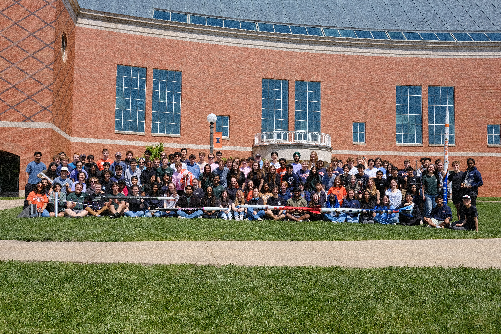

# The Illinois Space Society 🚀

We do epic tech projects like rockets (think: epic avionics systems) and engines (think: DAQ systems and test software)

  

## Spaceshot Avionics Repos

### Flight-Critical Systems

| Name | Description | Point of Contact | Active |
|---|---|---|---|
| [MIDAS-Software](https://github.com/ISSUIUC/MIDAS-Software) | Illinois Space Society's main flight software codebase for the MIDAS avionics system | Thomas McMananamen; Melody Parker; Ahmed Khan; Eddie Tang |✅|
| [MIDAS-Hardware-Test](https://github.com/ISSUIUC/MIDAS-Hardware-Test) | Unit testing repository for the MIDAS sensor suite| Melody Parker |✅ |
| [GNC-SILSIM](https://github.com/ISSUIUC/GNC-SILSIM) | Illinois Space Society's Guidance, Navigation, and Contol Software-in-the-Loop simulation | Ahmed Khan |✅|
| [BAGEL-Software](https://github.com/ISSUIUC/BAGEL-Software) | Illinois Space Society's main flight software codebase for BAGEL, our Bluetooth Switch Board | Melody Parker | ✅|
| [BAGEL-App](https://github.com/ISSUIUC/BAGEL-App) |Illinois Space Society's codebase of the BLE React Native app to interface with the BAGEL board | Melody Parker; Alyssa LoVerde |✅ |
| [ISS-AV-STR](https://github.com/ISSUIUC/ISS-AV-STR) | Illinois Space Society's AV bay design, harnessing, and sims | Miriam Nebu |✅ |
| [ISS-PCB](https://github.com/ISSUIUC/ISS-PCB) | Illinois Space Society's AV PCB design | Kacper Paraniuk |✅ |
| [ISS-Recovery](https://github.com/ISSUIUC/ISS-Recovery) | Illinois Space Society's Recovery System | Gage Bingaman |✅ |

### Auxiliary Flight Systems

| Name | Description | Point of Contact | Active |
|---|---|---|---|
| [CAM-Software](https://github.com/ISSUIUC/CAM-Software) |Flight software for the CAM MK3 and EAGLE boards as part of ARRL Big Brother | Eddie Tang |✅ |
| [CAM-Software-Test](https://github.com/ISSUIUC/CAM-Software-Test) | LR2021 Driver testing and implementation. Can be used for CAM & EAGLE bringup when issues need to be isolated| Eddie Tang | ✅|

### Auxiliary Ground Systems

| Name | Description | Point of Contact | Active |
|---|---|---|---|
| [MIDAS-BASE](https://github.com/ISSUIUC/MIDAS-BASE) | Application that allows us to interface directly with MIDAS and Feather Duo | Muhammad Ali; Melody Parker | ✅|
| [GroundStation](https://github.com/ISSUIUC/GroundStation) |Spaceshot's main ground station codebase |Melody Parker|✅|
| [TeleDecode](https://github.com/ISSUIUC/TeleDecode) | Software for our TeleDecoder board meant to interface with TeleMegas|Jennifer Luo; Benson Zhou|✅ |
| [TelemegaDecode](https://github.com/ISSUIUC/TelemegaDecode) | Application that allows us to decode and display telemetry from Altus Metrum altimeters| Thomas McMananamen | ❌|
| [SAM-Turret](https://github.com/ISSUIUC/SAM-Turret) |Illinois Space Society's codebase for controls and software necessary for SAM Turret | Ahmed Khan; Max Kulasik |✅ |

### Onboarding

| Name | Description | Point of Contact | Active |
|---|---|---|---|
| [ISS-Git](https://github.com/ISSUIUC/ISS-Git) |Illinois Space Society's Git tutorial | Eddie Tang |❌ |
| [ISS-GNC-Onboarding](https://github.com/ISSUIUC/ISS-GNC-Onboarding) |Illinois Space Society's  GNC team onboarding | Ahmed Khan| ✅ |

### Archive/Documentation

| Name | Description | Point of Contact | Active |
|---|---|---|---|
| [ISS-PCB-Archive](https://github.com/ISSUIUC/ISS-PCB-Archive) | Archive of PCBs that are more than 1 to 2 years old| Eddie Tang |❌ |
| [MIDAS-flight-docs](https://github.com/ISSUIUC/MIDAS-flight-docs) |Automated documentation for MIDAS flight software | Eddie Tang|❌ |
| [ISS-Controls](https://github.com/ISSUIUC/ISS-Controls) | Illinois Space Society's 6-DOF System for the MIDAS avionics system| Ahmed Khan |❌ |
